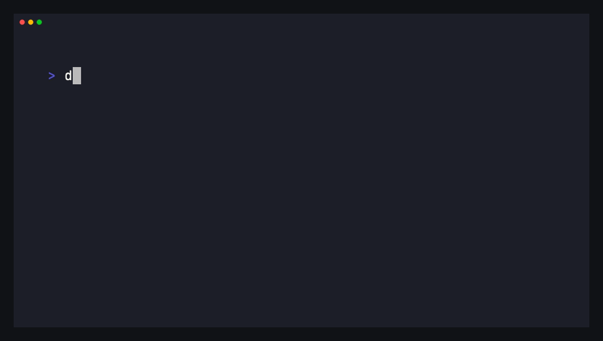

<p align="center">
  
</p>

<h1 align="center">dotagents</h1>

<p align="center">
  <strong>One portable home for the AI-agent skills you have collected.</strong><br />
  Set it up once, use it with compatible agents, and take it to another computer when you are ready.
</p>

<p align="center">
  <a href="https://github.com/beautyfree/dotagents/actions/workflows/ci.yml"></a>
  <a href="LICENSE"></a>
  <a href="https://github.com/beautyfree/dotagents/stargazers"></a>
</p>



## What it does

AI agents store skills in different places. `dotagents` gives you one library —
normally `~/.agents` — and safely makes its skills available to the compatible
agents already installed on your computer.

| You have | dotagents does |
| --- | --- |
| A skill in `~/.agents/skills` | Keeps it in the shared library; agents that read the shared folder use it directly. |
| A compatible agent with an empty skills folder | Creates per-skill links back to the library. No duplicate copy to maintain. |
| A non-empty or unfamiliar agent folder | Leaves it alone. It never replaces files it does not manage. |
| A skills.sh package with verifiable provenance | Records a pinned source instead of uploading another copy. |

> [!IMPORTANT]
> `dotagents setup` does **not** publish anything. It only creates or updates
> your local `~/.agents` library after one confirmation. When you choose to
> connect GitHub, GitLab, or another Git server, dotagents records only its
> credential-free remote address on this computer. It creates a remote only if
> you explicitly select **Create a new private library** and confirm its exact
> name; pushing remains a separate `dotagents sync` confirmation.

## Start here

Install the CLI, then run one command:

```sh
npm install -g dotagents
dotagents setup
```

The command shows what it found and asks once before it changes anything. If
you want to carry the library elsewhere, choose GitHub, GitLab, or **Another
Git server** and enter that server's Git URL once. After you answer `y`, it:

1. creates `~/.agents` if necessary;
2. brings in skills that are safe to own, while retaining verified external
   sources as references;
3. connects compatible empty agent folders with links; and
4. reports exactly what is now available.

Choosing GitHub or GitLab first asks permission to let that provider's own CLI
list writable repositories, so you can reuse an existing library without
remembering its URL. This is separate from reviewing library content and from
creating a remote; automated setup must opt in with `--allow-provider-network`.

If you install another agent later, run this to connect it without touching
existing agent files:

```sh
dotagents connect
```

Check the current connections at any time:

```sh
dotagents status
```

## Back up or share your library

After the one-time setup, syncing never asks you to remember a path or remote.
It uses the saved library connection on this computer, reviews portable files
for secrets, and asks for confirmation before it writes or pushes.

```sh
dotagents sync
```

Choose the repository visibility that fits your use: private for a personal
backup, team-accessible for shared work, or public only after you have reviewed
its contents. Before using a public remote, run:

```sh
dotagents doctor ~/.agents
dotagents audit ~/.agents --public
```

Secret checks point to a file and line but never print the matched value.

## Restore on a new computer

On a new computer, start with `dotagents setup`. Pick GitHub or GitLab and
choose an existing repository, or review a new private library name before
dotagents creates it through the provider CLI. For a company or self-hosted
server, choose **Another Git server** and paste its Git URL once;
dotagents saves that connection locally and will not ask again. The `--remote`
option remains available for scripts and managed deployments. Before writing
`~/.agents`, it reviews and pins the exact remote commit, then safely connects
compatible agents it finds.

```sh
dotagents setup
```

## What dotagents will not do

- It does not create a remote repository unless you explicitly select and
  confirm its exact private name; it never makes one public on its own.
- It does not push until a separate reviewed `dotagents sync` confirmation.
- It does not overwrite an existing agent skill or follow a linked file outside
  a skill folder.
- It does not silently trust a network source; network operations require an
  explicit trust rule.
- It does not run skill code while discovering, reviewing, or copying files.

## Need the deeper controls?

The normal route is `setup` → `sync` → `setup` on another
computer. For dry runs, automation, recovery, source trust, and the complete
command reference, see:

- [Everyday workflows](docs/workflows.md)
- [Full CLI reference](docs/README.md)
- [How resources stay portable](docs/resource-model-v2.md)
- [Supported Agent Skills conventions](docs/rfc-210-compatibility.md)

dotagents is open source, provider-neutral, and works with any Git host that
you choose.
